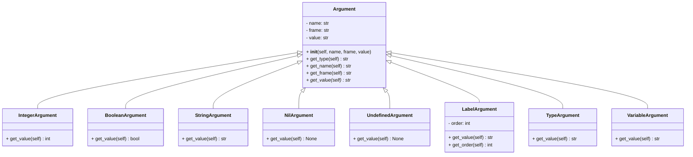

Implementation documentation of 2 task for IPP 2022/2023

Name and surname: Nikita Moiseev

Login: xmoise01

# Interpreter flow

## XML parsing

The interpreter begins its work by parsing an XML file using the `main`
function. This function utilizes the `xml` library to parse the XML file.

### XML checking

XML checking is the first action performed by the interpreter. This task is
carried out by the `checkXML` function, which verifies the validity of the XML
file. The function checks the tags and attributes for all the instructions, as
well as the order of the instructions.

### XML processing

XML processing is the second action performed by the interpreter, which is
handled by the `processXML` function. The first step in processing the XML file
is to process the labels, which is done by the `preprocessLabels` function. This
step is performed before processing the instructions, as it is necessary to have
all the labels in the map before processing instructions. This is crucial
because instructions may jump to labels that are defined later in the code.

Next, the instructions are processed using a loop for all instructions. The
order of instructions and jumps are handled using the program counter `pc`,
which is stored in the [Memory](#memory-singleton) singleton. If the
instruction is not a jump, `pc` is incremented by 1. If the instruction is a
jump, `pc` is set to the order of the label that is being jumped to.

### Instruction execution

During the instruction processing stage, each instruction is executed by first
obtaining its `opcode` and then creating a corresponding instruction object
based on the `INSTRUCTIONS_MAP`. The instruction classes use
the [Command design pattern](#instructions-command-design-pattern) where each
instruction has its own class that inherits from the `Instruction` class. Each
instruction class also has its own execution function `execute`, which is called
when the instruction is executed.

Next, the arguments for each instruction are processed. Each argument has a
corresponding class based on its type, such as `VariableArgument` for arguments
of type `var`. All argument instances are stored in the `arguments` list and
passed to the instruction's initialization function. The argument classes
inherit from the abstract parent class [Argument](#argument-classes), which
has its own initialization and other methods. The only abstract method is
`get_value`, which is implemented in child classes. This is necessary because
each argument has its own way of obtaining its value. For example, an argument
of type `var` gets its value from the memory, while an argument of type `int`
obtains its value from the `value` attribute of the XML element.

During instruction and argument processing, XML checks are performed. In case of
an error, an exception is thrown and the program is terminated.

Finally, the instruction is executed by calling its `execute` method of the
corresponding instruction class, which happens after all the arguments of the
instruction have been processed.

### Instruction execution loop

All instructions are executed in a loop, with the program counter being
incremented by one before each instruction is executed. After the instruction is
executed, the program counter remains unchanged if the instruction is not a jump
instruction. However, if the instruction is a jump instruction, the program
counter is set to the order of the label to which the instruction jumps. The
next instruction is then processed.

# Used design patterns

## Memory singleton

The `Memory` class serves as a singleton that stores all the variables and
frames of the program. The following logical parts are stored within
the `Memory` class:

- Global frame
- Local frame
- Temporary frame
- Frames' stack
- Variables in the frames
- Call stack
- Labels
- Program counter

The `Memory` class singleton is implemented using the `MemoryMeta` metaclass. In
Python, metaclasses are used to create singletons. The `MemoryMeta` metaclass is
inherited from the `type` metaclass and overrides the `__call__` method. This
method is called when the `Memory` class is called. It checks if the `Memory`
class has already been created. If it has not been created, it creates
the `Memory` class. If it has already been created, it returns the previously
created `Memory` class.

This pattern is used because it is necessary to have only one instance of the
`Memory` class. This is important because the `Memory` class stores all the
variables and frames of the program. Having only one instance of the `Memory`
class ensures that there is only one set of variables and frames for every
instruction execution.

### Memory singleton diagram

## Instructions command design pattern

The instructions command design pattern is used in the program to handle the
execution of each instruction. This pattern involves creating a separate class
for each instruction, all of which inherit from the `Instruction` base class.
Each instruction class has its own `execute` function which is called when the
instruction is executed.

The `Instruction` base class has an `__init__` function which is called when the
instruction is created. This function is responsible for storing the arguments
of the instruction, which are stored in the `arguments` attribute of the
instruction.

The `execute` function of the `Instruction` base class is abstract and is
implemented in child classes. This is necessary because each instruction has its
own unique way of execution. For instance, the `MOVE` instruction moves the
value of argument 1 to argument 2, while the `ADD` instruction adds the values
of arguments 2 and 3 and stores the result in argument 1.

By using this pattern, the program is able to handle the execution of each
instruction in a modular and scalable manner.

### Instructions command design pattern diagram

## Argument classes

The argument classes inherit from the abstract parent class `Argument`. The
parent `Argument` class has its own initialization function `__init__` which is
called when an argument is created. The argument value, name, and frame
are stored in the `value`, `name`, and `frame` attributes of the argument.
The `value`attribute is the string representation of the value of the argument.

Each child class has its own way of getting the value of the argument. For
example, an argument of type `int` gets its `value` from the value attribute by
converting it to an integer. This is done in the child class's initialization
function, which calls the parent initialization function and then converts the
`value` attribute to an integer.

Other argument classes, such as `VariableArgument`, have their own ways of
getting the argument value based on their type and position in the memory
hierarchy. These differences are handled in the child classes' initialization
functions.

### Argument classes diagram

# Helper functions

## `value_check` function

`value_check(value: any, check: int) -> bool` function is utilized to verify if
the argument's value is valid, by checking the flags set in the `check`
variable. The `check` variable is a bit mask, with each bit representing a
specific check to be performed. If the value is valid, the function returns
`True`, otherwise, it returns `False`. This function is used in the instructions
before executing them.

## `values_check` function

`values_check(value1, value2, check: int) -> bool` is a function that checks if
the values of two arguments are valid. It is primarily used to ensure that both
arguments have the same data type, which is required for some instructions. In
addition, the values are checked against the flags specified in the `check`
variable using the `value_check` function. This function is essential to ensure
the correct and safe execution of instructions in the program.

## `variable_check` function

`variable_check(variable: VariableArgument, check: int) -> bool` function is
used to verify the validity of a variable. It performs checks to determine if
the variable exists, if it is not undefined, and if its frame is valid. The
`check` variable is a bit mask, where each bit represents a specific check to be
performed. If the variable is found to be valid, the `variable_check` function
returns `True`. Otherwise, it returns `False`. This function is utilized in
instructions to validate variables before their use.

## `Helpers` class

The `Helpers` class is a utility class used to store static helper functions
that
are utilized by the interpreter. It contains the following methods:

- `replace_special_chars(input_str)`: This method replaces special characters in
  the given string with their respective escape sequences and returns the
  modified string.
- `process_output(arg) -> str`: This method processes the output of the `WRITE`
  instruction and returns a string representation of the argument.
- `variable_args_check(args: List[Argument], check1, check2, check3)`: This
  method checks the validity of the variable arguments in an instruction. It
  ensures that each argument is valid based on the specified checks for each
  argument. The `check1`, `check2`, and `check3` variables are bit masks, where
  each bit represents a check.
- `math_args_check(args: List[Argument]) -> bool`: This method checks the
  validity of the arguments in the `ADD`, `SUB`, `MUL`, and `IDIV` instructions.
- `relational_args_check(args: List[Argument]) -> bool`: This method checks the
  validity of the arguments in the `LT`, `GT`, and `EQ` instructions.
- `logical_args_check(args: List[Argument], is_not) -> bool`: This method checks
  the validity of the arguments in the `AND`, `OR`, and `NOT` instructions.
  The `is_not` parameter is a Boolean value that determines whether the `NOT`
  instruction is being checked or not.

# Interpreter flow diagram

